# Three awesome models
Assignment 2 for Computer Vision &amp; Deep Learning course at Innopolis University

## Project Description

This project is aimed to detect recycling codes: PP (5), PAP (20-22), ALU (41). To achive that, I use three models: YOLOv4, YOLOv5, and MaskRCNN. You can find all Jupyter notebooks and resulting folders at this [google drive folder](https://drive.google.com/drive/folders/1gHMC1etvBosvCI_ABcaIyHHHY1AYIrHd?usp=sharing). I highly advise to view Jupyter from the folder because the ones in GitHub do not display the images from the models' inferences.

## Data Acquisition and Annotation

I took photos of whatever I found at home. You can see examples below:

Since I didn't have much of aluminium stuff, the dataset is a bit unbalanced. The statistics is the following:

| Class name | Images count | Objects count |
| ---------- | ------------ | ------------- |
| PAP        | 31           | 32            |
| POL        | 36           | 37            |
| ALU        | 29           | 29            |

The numbers in _Objects Count_ column is different from the numbers in _Objects Count_ column because some images contain more than 1 class.

<div style="display: flex; align-items: center; justify-content: center;">
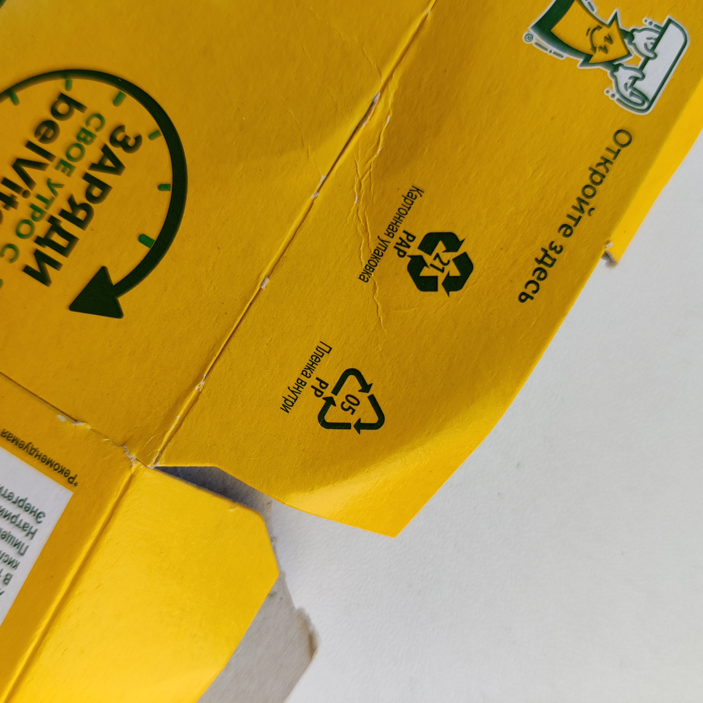
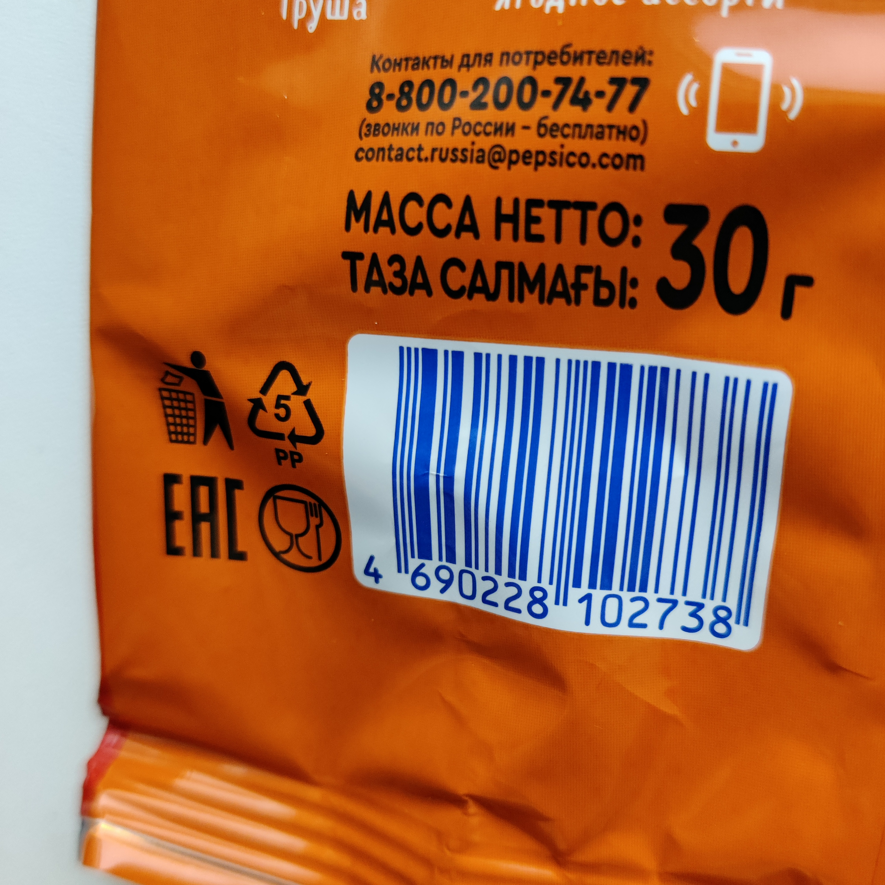
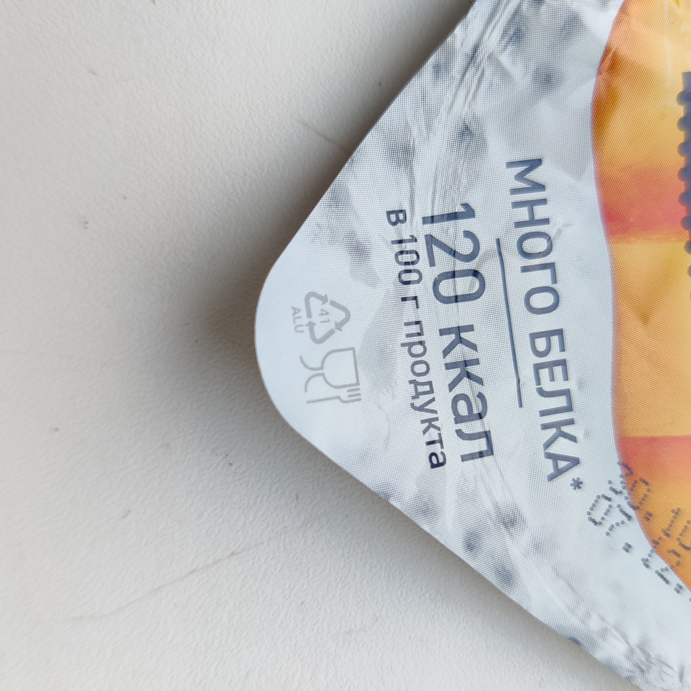
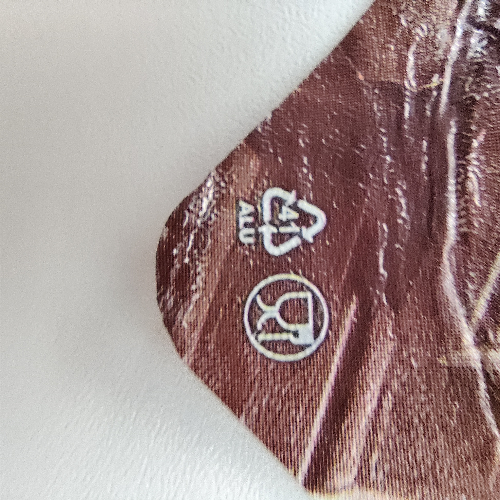
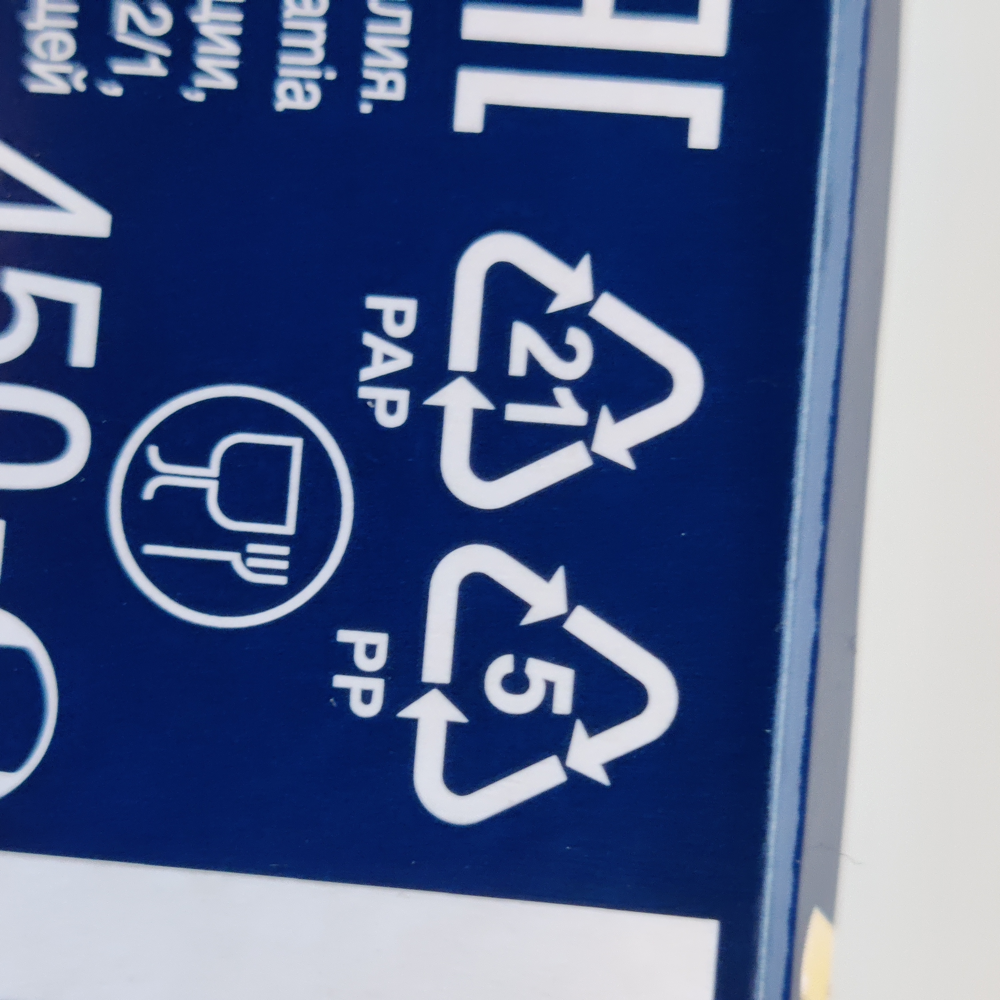
</div>

I used [supervisely](https://app.supervise.ly/) to create polygon-annotations for the images. I present the examples of annotated objects below.

<div style="display: flex; align-items: center; justify-content: center;">

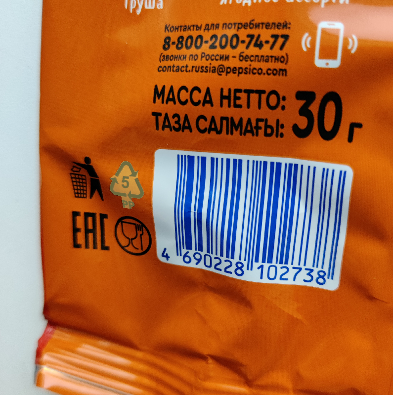
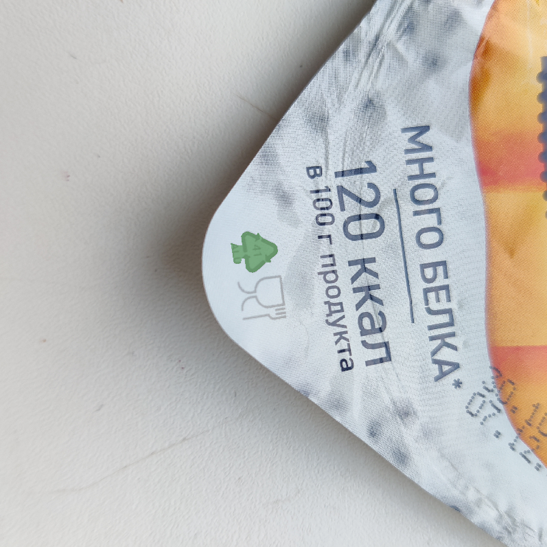
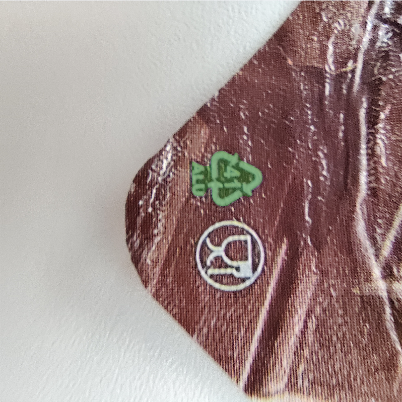
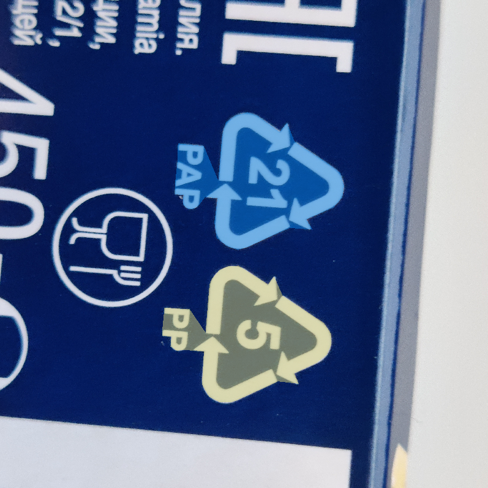
</div>

## Data Preprocessing and Augmentation

### For YOLOv4 and YOLOv5
I used [roboflow](https://roboflow.com/) to augment the dataset, increase its size by 3, and convert polygons to bounding boxes which YOLOs need. The reason to use Roboflow is that YOLOv4 requires data in Darknet format and YOLOv5 requires data in yolov5-pytorch format. Changes in the dataset are the following:

**Preprocessing**
- Auto-Orient: Applied

**Augmentations**
- Outputs per training example: 3
- Rotation: Between -45° and +45°
- Shear: ±20° Horizontal, ±20° Vertical
- Hue: Between -180° and +180°
- Saturation: Between -50% and +50%
- Brightness: Between -30% and +30%
- Blur: Up to 2.75px

I present the examples of augmentated images below.

<div style="display: flex; align-items: center; justify-content: center;">
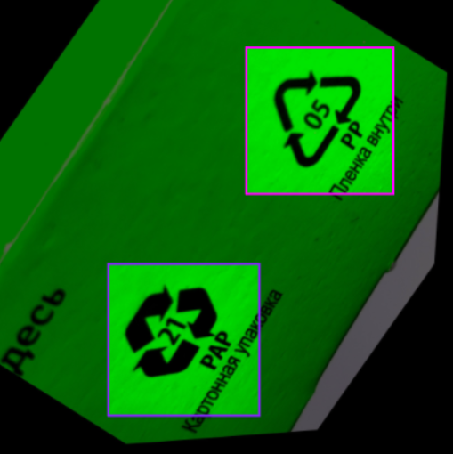
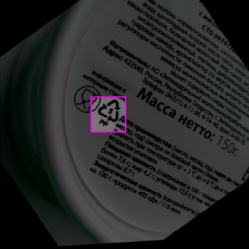
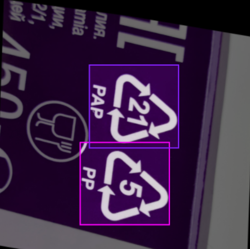
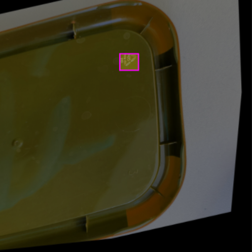
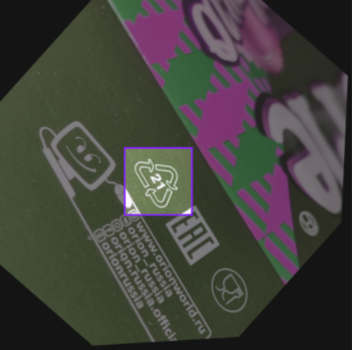
</div>

### For MaskRCNN

I used [supervisely](https://app.supervise.ly/) to augment the dataset and increase its size. The reason to use Supervisely is that MaskRCNN requires data in this format (a list of dictionaries created from .json file):

```python
dataset = [{'file_name': 'image1.jpg',
            'image_id': ID,
            'height': H,
            'width': W,
            'annotations': [
                {
                 'segmentation': [[x_0, y_0, x_1, y_1, ..., x_n, y_n]], 
                 'bbox': [x_0, y_0, x_1, y_1],
                 'bbox_mode': BoxMode.XYXY_ABS,
                 'category_id': 0 },
                {
                 'segmentation': [[x_0, y_0, x_1, y_1, ..., x_n, y_n]], 
                 'bbox': [x_0, y_0, x_1, y_1],
                 'bbox_mode': BoxMode.XYXY_ABS,
                 'category_id': 1 }]},
            ...]
```

I added augmentations by using supervisely's DTL language to write a config and run the job. The result of this is a new dataset that has 234 images.

**Augmentations**:
- Resize: 700x700, keep aspect ration
- Rotate: Between -180° and +180°
- Gaussian Blur: sigma between 0.5 and 2
- Contrast: between 0.5 and 2
- Brightness: between -50 and 50
- Random Color

## Training YOLOv4

### Results

## Training YOLOv5

### Results

## Training MaskRCNN

### Results

