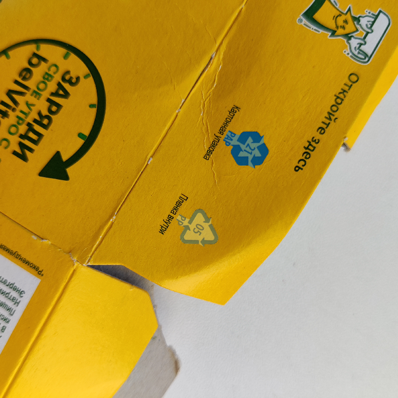
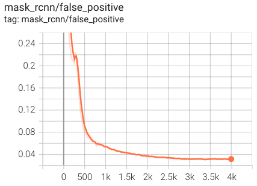

# Three awesome models

Assignment 2 for Computer Vision &amp; Deep Learning course at Innopolis University

## Shortcut: Links to Colab Notebooks

It's highly advised to view Jupyter Notebooks from Colab because GitHub does not display some outputs.

[YOLOv4-tiny](https://colab.research.google.com/drive/1wYGkd6upzia8fPyI-Ft6TA2_ASqCqhou?usp=sharing) |
[YOLOv5-tiny](https://colab.research.google.com/drive/1t-sz0c1Jal0283zRVZLB_wBa-pdkfeRM?usp=sharing) |
[MaskRCNN](https://colab.research.google.com/drive/10N_UdY9q9dUKKxfRsnpGJpAbRoeMrIoK?usp=sharing)

## Project Idea

This project is aimed to detect recycling codes: PP (5), PAP (20-22), ALU (41). To achive that, I use three models: YOLOv4, YOLOv5, and MaskRCNN. You can find all Jupyter notebooks and resulting folders at this [Google Drive folder](https://drive.google.com/drive/folders/1gHMC1etvBosvCI_ABcaIyHHHY1AYIrHd?usp=sharing).

## Data Acquisition and Annotation

I took photos of whatever I found at home. You can see examples below:

Since I didn't have much of aluminium stuff, the dataset is a bit unbalanced. The statistics is the following:

| Class name     | Images count | Objects count |
| -------------- | ------------ | ------------- |
| **PAP**        | 31           | 32            |
| **POL**        | 36           | 37            |
| **ALU**        | 29           | 29            |

The numbers in _Objects Count_ column is different from the numbers in _Objects Count_ column because some images contain more than 1 class.

<div style="display: flex; align-items: center; justify-content: center;">


</div>

I used [supervisely](https://app.supervise.ly/) to create polygon-annotations for the images. I present the examples of annotated objects below.

<div style="display: flex; align-items: center; justify-content: center;">



</div>

## Data Preprocessing and Augmentation

### For YOLOv4 and YOLOv5
I used [roboflow](https://roboflow.com/) to augment the dataset, increase its size by 3, and convert polygons to bounding boxes which YOLOs need. The reason to use Roboflow is that YOLOv4 requires data in Darknet format and YOLOv5 requires data in yolov5-pytorch format. Changes in the dataset are the following:

**Preprocessing**
- Auto-Orient: Applied

**Augmentations**
- Outputs per training example: 3
- Rotation: Between -45° and +45°
- Shear: ±20° Horizontal, ±20° Vertical
- Hue: Between -180° and +180°
- Saturation: Between -50% and +50%
- Brightness: Between -30% and +30%
- Blur: Up to 2.75px

I present the examples of augmentated images below.

<div style="display: flex; align-items: center; justify-content: center;">


</div>

### For MaskRCNN

I used [supervisely](https://app.supervise.ly/) to augment the dataset and increase its size. The reason to use Supervisely is that MaskRCNN requires data in this format (a list of dictionaries created from .json file):

```python
dataset = [{'file_name': 'image1.jpg',
            'image_id': ID,
            'height': H,
            'width': W,
            'annotations': [
                {
                 'segmentation': [[x_0, y_0, x_1, y_1, ..., x_n, y_n]], 
                 'bbox': [x_0, y_0, x_1, y_1],
                 'bbox_mode': BoxMode.XYXY_ABS,
                 'category_id': 0 },
                {
                 'segmentation': [[x_0, y_0, x_1, y_1, ..., x_n, y_n]], 
                 'bbox': [x_0, y_0, x_1, y_1],
                 'bbox_mode': BoxMode.XYXY_ABS,
                 'category_id': 1 }]},
            ...]
```

I added augmentations by using supervisely's DTL language to write a config and run the job. The result of this is a new dataset that has 234 images.

**Augmentations**:
- Resize: 700x700, keep aspect ratio
- Rotate: Between -180° and +180°
- Gaussian Blur: sigma between 0.5 and 2
- Contrast: between 0.5 and 2
- Brightness: between -50 and 50
- Random Color

<div style="display: flex; align-items: center; justify-content: center;">


</div>

I got the following statistics for this dataset:

| Class name     | Images count | Objects count |
| -------------- | ------------ | ------------- |
| **PAP**        | 93           | 96            |
| **POL**        | 108          | 111           |
| **ALU**        | 87           | 87            |

Finally, to get the required data representation, I've written my own python script that takes a path to dataset and creates two _.json_ files: one for training and one for validation - by default _train.json_ and _valid.json_ respectively.

## Training YOLOv4

I used tiny-config and Darknet data format to train YOLOv4. As described before, I used Roboflow to convert dataset in Supervisely format to dataset in Darknet format.

- YOLOv4 trained for 6000 iterations
- Last accuracy: 79.66%; best accuracy: 83.51%
- The model saw 360000 images
- mAP:

| CLass Name | Average Precision, % | True Positive (TP) | False Positive (FP) |
| ---------- | -------------------- | ------------------ | ------------------- |
| **ALU**    | 70.24                | 4                  | 0                   |
| **PAP**    | 67.26                | 5                  | 3                   |
| **POL**    | 100.00               | 8                  | 0                   |

As I wrote before, POL class had the highest number of images and PP recyling code is always associated with 5, whereas PAP and ALU codes could be associated with multiple numbers. Probably that is why mAP for POL class is 100%.

- Other metrics:

| Confidence threshold | Precision | Recall | F1-score | TP   | FP   | FN   | average IoU |
| -------------------- | --------- | ------ | -------- | ---- | ---- | ---- | ----------- |
| 0.25                 | 0.85      | 0.77   | 0.81     | 17   | 3    | 5    | 57.11%      |

### Input


### Output


## Training YOLOv5

I used tiny-config and pytorch-yolo data format to train YOLOv5. As described before, I used Roboflow to convert dataset in Supervisely format to dataset in yolov5 format.

### Training without initial weights

- YOLOv5 trained for 1400 epochs (early stopping due to small improvement over the last 1000 epochs);
- Last precision: 86%; Last recall: 47%; Last mAP: 29%;
- Reached 1400th epoch after 1hr 40mins - very slow!

Maybe if I trained it for even longer, the metrics would increase, but I decided to move on to training with pretrained weights.

#### Prediction on test set (best weights)

First image has a false positive prediction of ALU with confidence over 60%. Second image has a correct prediction. Third image has one correct prediction and two false positives. The last image has no predictions for it. :C


### Training with initial weights

- YOLOv5 trained for 1750 epochs (early stopping due to small improvement over the last 1000 epochs);
- Last precision: 92%; Last recall: 45%; Last mAP: 48%;
- Reached 1400th epoch after 2hr 16mins - very slow!

#### Prediction on test set (best weights)

First and second images do not have any predictions at all. Third and forth have correct predictions.


### Comparison

| YOLOv5 type           | Precision | Recall | mAP  |
| --------------------- | --------- | ------ | ---- |
| **YOLOv5**            | 86%       | 47%    | 29%  |
| **Pretrained YOLOv5** | 92%       | 45%    | 48%  |

**Orange**: without initial weights
**Blue**: with initial weights

YOLOv5 with and without pretrained weights showed nearly the same performance, and it's still bad comparing to YOLOv4. Both models showed good results on train set and very bad results on test set. 


### Potential problem

The problem could lie in parameters such as IoU threshold and confidence score. I set condifence score to 0.6 and IoU threshold to 0.45. 

## Training MaskRCNN

These few lines contain a dense and most important information about configuration for the model:
1. I use pretrained weights from `COCO-InstanceSegmentation/mask_rcnn_R_50_FPN_3x.yaml`.
2. Initial learning rate is 0.0002
3. Number of iterations: 4000.
4. Decrease learning rate by 0.5 at iterations: 2800, 3600.
5. Images size is 700x700.
6. Finished after 58 minutes - very fast!

I have already described the way I augmented and transformed the data for MaskRCNN and visualized it, so just enjoy the statistics and results! :)

## Metrics

### FastRCNN

<div style="display: flex; align-items: center; justify-content: center; flex-direction: column;">


</div>

### MaskRCNN
<div style="display: flex; align-items: center; justify-content: center; flex-direction: column;">


</div>

### Final Metrics

Evaluation results for segmentation:
|   AP   |  AP50   |  AP75   |  APs   |  APm   |  APl   |
|--------|---------|---------|--------|--------|--------|
| 89.765 | 100.000 | 100.000 | 85.050 | 90.040 | 94.175 |

Per-category segm AP:
| Class Name     | AP     |
|----------------|--------|
| **PAP**        | 90.644 |
| **POL**        | 88.651 |
| **ALU**        | 90.000 |

It is very interesting that here POL does not have the heighest score, as we saw that it has a little bit more smaples than other classes.

### Output

I am very satisfied with the results! Maybe the augmentation from Supervisely played a role here, but...
1. The training of MaskRCNN was faster
2. The results are awesome
3. The model is confident
4. The masks are ultra fitting

<div style="display: flex; align-items: center; justify-content: center;">


</div>
